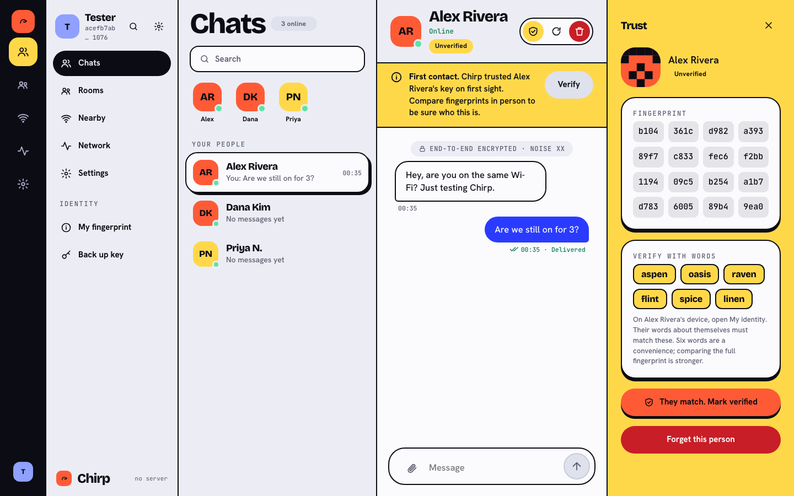
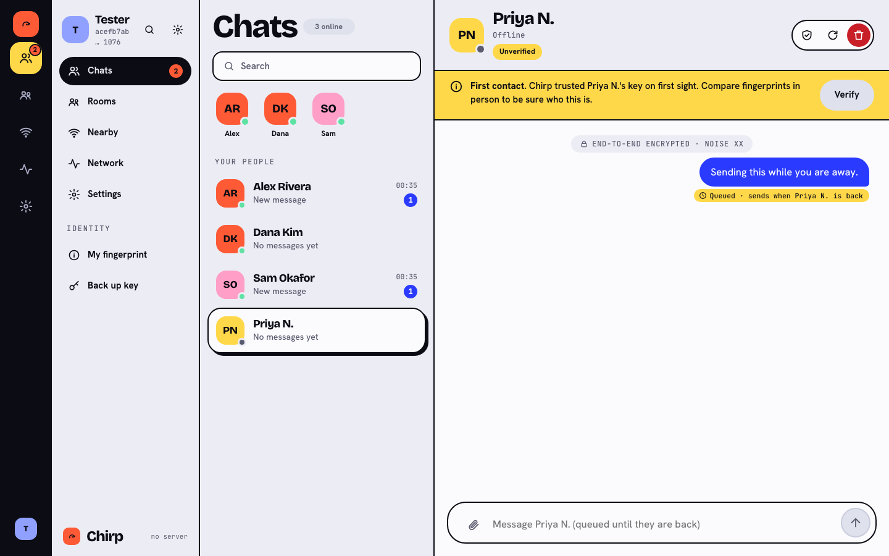
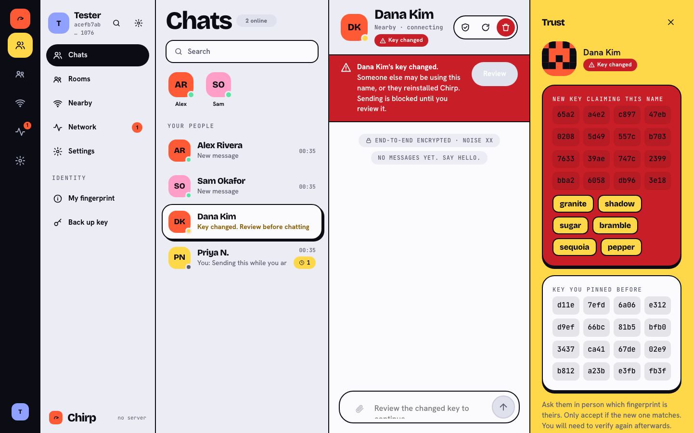
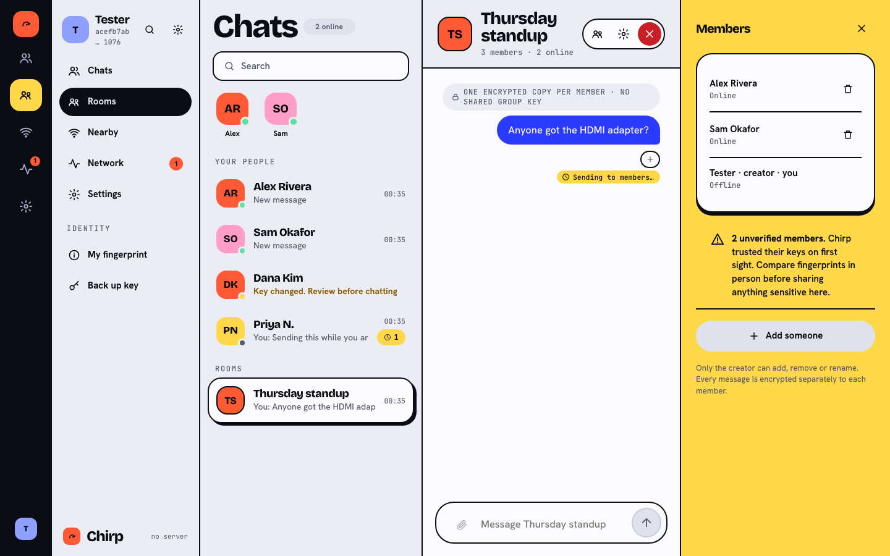
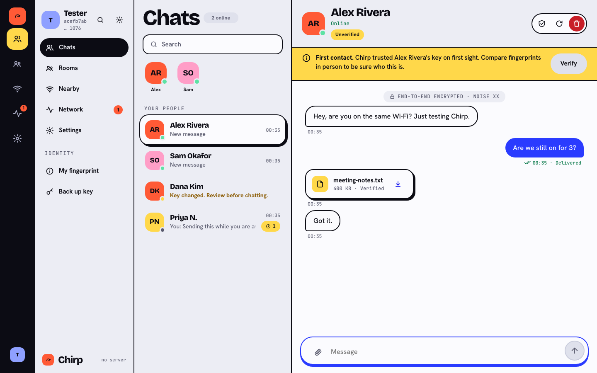
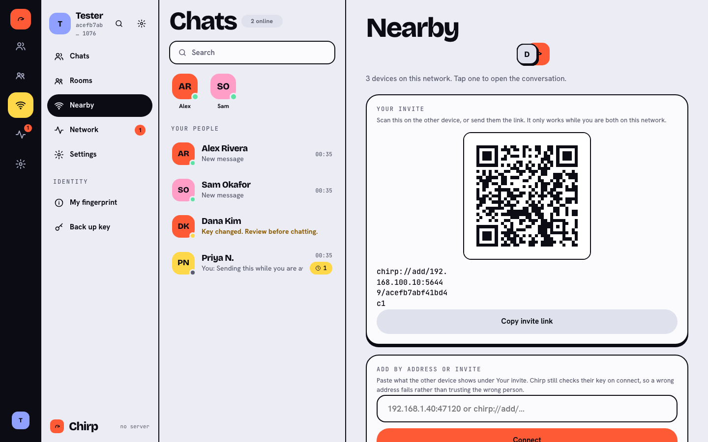
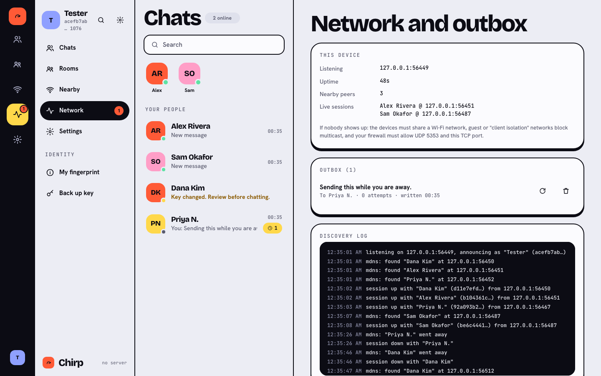
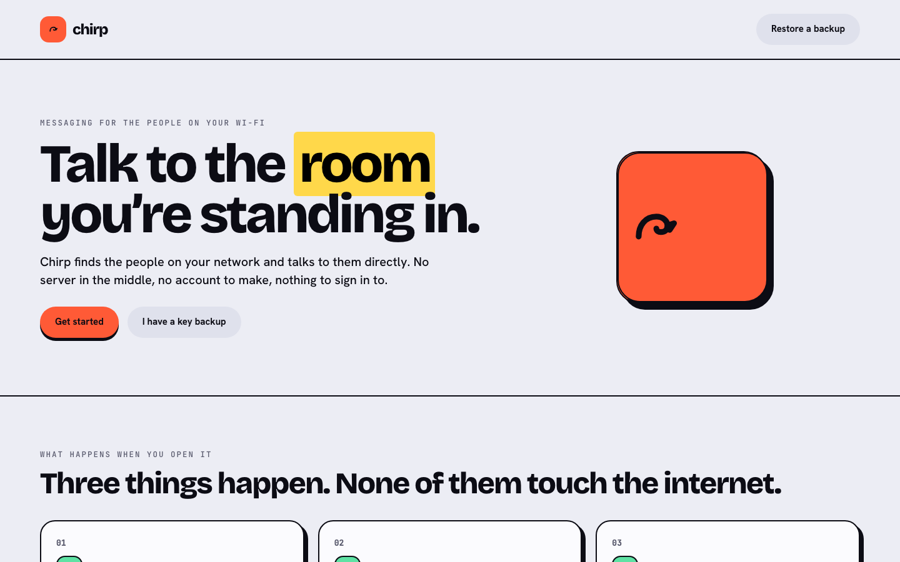
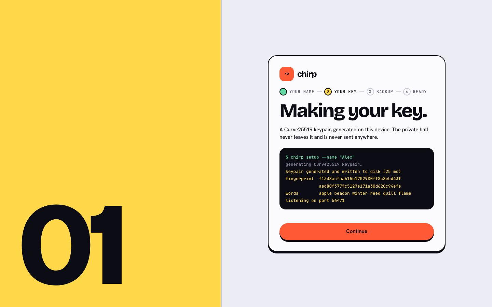
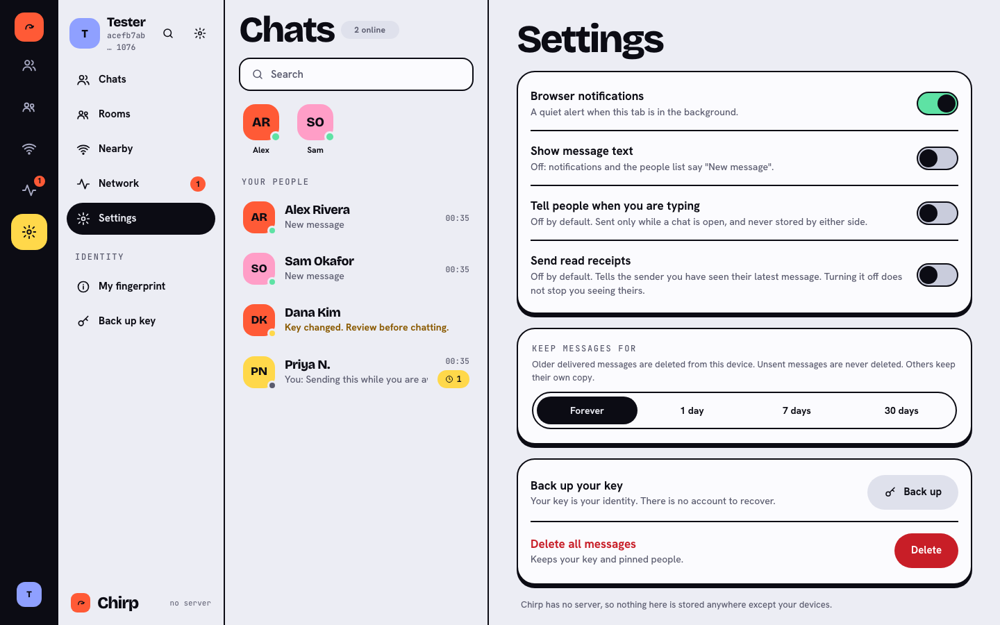

# Chirp

Serverless, end-to-end encrypted messaging for people on the same Wi-Fi.

Chirp finds nearby devices with mDNS, opens a Noise-encrypted TCP session directly between them, and stores everything in a local database. There is no server, no account and no internet requirement. A Go daemon does the work and serves a web UI on `127.0.0.1`.



The design language (bold editorial: ink, paper, cobalt, tangerine) and a clickable prototype live in [`design/`](design/).

## Try it

Needs Go 1.23+.

```sh
go mod tidy        # first time only, writes go.sum
make demo          # scripted peers, works with no network at all
```

Open <http://127.0.0.1:7777>. Four bots are in the room: Alex and Sam chat back, Priya drops offline every minute (send her something and watch it queue in the outbox, then deliver), and after about 45 seconds Dana's key changes so you can see the trust warning. Alex also sends a small file, so you can watch a transfer arrive, get verified against its checksum and be offered to save.

To use it for real, on two machines on the same network:

```sh
make run           # then open http://127.0.0.1:7777 and pick a name
```

Everyone running Chirp on the network shows up under **Your people** within a few seconds.

| | |
| --- | --- |
|  |  |
| Offline peer: the message waits in the outbox and retries. | A different key claimed a pinned name. Sending is blocked until you review it. |
|  |  |
| Rooms fan out one encrypted copy per member, and say who is unverified. | Transfers are chunked, resumable and checked against the sender's hash. |
|  |  |
| When discovery is blocked, share an address or scan the invite. | Live sessions, outbox and a discovery log. |
|  |  |
| What a first run sees. | The setup log prints the key that was actually made, not a scripted animation. |
|  | |
| Retention, privacy toggles, backup and wipe. | |

Every screenshot here is captured from the running UI by `make screenshots`,
which drives `cmd/demo` and asserts it is looking at the right screen before it
takes the picture.

## What is interesting about it

**Trust, not just encryption.** Noise XX authenticates both keys but says nothing about *whose* key it is. Chirp pins the first key it sees under a name (TOFU), flags any later change, blocks sending until you review it, and lets you upgrade a pin to *verified* by comparing a 16-group fingerprint or six words in person. Accepting a new key resets verification.

**Delivery you can reason about.** Messages are written to a bbolt outbox before the network is touched, sent at-least-once with backoff, acknowledged only after the receiver has persisted them, and deduplicated by ID. Kill either side mid-conversation and nothing is lost or shown twice. Automated tests cover this against the in-memory discovery hub; I also ran two separate `chirpd` processes over real mDNS by hand and checked a queued message delivered after a restart.

**Hostile-input hygiene.** Everything that arrives from the network is untrusted: mDNS records are validated, the frame and envelope decoders are strict and fuzzed, half-open handshakes are capped, and silent peers are timed out at 30 s.

**A browser-safe local API.** A daemon on loopback is still reachable from any web page you visit. The API checks the Host header (DNS rebinding), requires a custom header on writes (CSRF), refuses foreign origins, sets a strict CSP, and the UI never uses `innerHTML` on peer-controlled text.

**Testable by design.** Discovery sits behind an interface, so the full engine (real TCP, real Noise, real bbolt) runs in-process against an in-memory hub with no multicast. That is also what `make demo` uses.

## How it works

```
browser ─ REST + SSE ─ api ─ app ─ node ─┬─ session (Noise XX) ─ proto (frames)
   (loopback only)                       ├─ store   (bbolt)
                                         └─ discovery (mDNS | in-memory)
```

* Each device advertises `_chirp._tcp` with its name and key fingerprint.
* For every pair, the device with the lower fingerprint dials. One connection, no races.
* The handshake is `Noise_XX_25519_ChaChaPoly_SHA256`; frames are length-prefixed and carry small JSON envelopes (`msg`, `ack`, `ping`).

Details: [docs/ARCHITECTURE.md](docs/ARCHITECTURE.md) for the package map and design decisions, [docs/PROTOCOL.md](docs/PROTOCOL.md) for the wire format, delivery semantics and threat model.

## Honest limits

Read these before you rely on it for anything.

* **First contact is trust-on-first-use.** Someone present when you first meet a name can impersonate it. Verify in person.
* **The six words are a convenience, not a proof.** They are 48 bits derived from one public key. Compare the full fingerprint for anything that matters.
* **The name is the identity handle.** Two people who pick the same name collide and one shows up as a key change. There is no rename yet.
* **Encryption at rest protects a stolen disk, not a stolen session.** Message bodies, pinned peers, room names and received files are encrypted with a key derived from your identity key, which sits in the same data directory at mode `0600`. So a copied database or an unencrypted backup yields nothing, but anyone who can read your user account's files can derive the key and read everything. It is not a passphrase.
* **Not audited.** It uses well-known primitives (`flynn/noise`, `x/crypto`) in a standard pattern, but the composition is mine and has had no outside review.
* **Some networks will not work.** Guest Wi-Fi with client isolation, VLAN splits and firewalls that drop UDP 5353 or the chosen TCP port all prevent discovery or connection. The Network screen lists the usual causes.
* **Desktop and browser only for now.** The Flutter mobile client is the next phase. It will speak this same protocol; `docs/testvectors.json` exists so it can be checked against this implementation byte for byte.
* **Rooms have no shared key and no global order.** Every room message is sent as one separately encrypted copy per member, so a member who leaves keeps everything they already received, and two people sending at the same moment have no defined relative order. Both limits are spelled out in [docs/ARCHITECTURE.md](docs/ARCHITECTURE.md).
* **File transfer holds whole files in memory.** Transfers resume after an interruption and are verified end to end against the sender's SHA-256, but both sides buffer the entire file rather than streaming it, so a 100 MB transfer costs 100 MB of RAM on each side.
* **Transport is TCP, not UDP.** The original brief called for UDP. TCP already provides the ordering Noise needs and the retransmission a reliable-UDP layer would have to reinvent. See the architecture doc for why, and where a datagram transport would plug in.

## Development

```sh
make race         # go test -race ./...   (what CI runs)
make fuzz         # 30 s of fuzzing on the wire decoder
make vet fmt
make vuln         # govulncheck
make e2e-install  # one-off: Playwright and its browser
make e2e          # drives the real UI against cmd/demo, desktop and phone
make screenshots  # recapture docs/img from the real UI
```

`make e2e` runs the browser suite in `e2e/`: onboarding, sending, replying,
deleting, queued messages, rooms, the invite QR and the command palette, plus
an axe-core scan that fails on any serious accessibility violation.

Layout:

```
cmd/chirpd      the daemon
cmd/demo        the daemon UI against scripted in-process peers
internal/
  identity      keys, fingerprint, words, encrypted backup
  proto         frames and envelopes (fuzzed)
  session       Noise XX handshake and encrypted channel
  store         bbolt: pins, messages, outbox, settings
  discovery     interface, mDNS, in-memory hub
  node          the engine, rooms, invites and QR
  app, api, web lifecycle, HTTP/SSE, embedded UI
e2e             Playwright suite driven against cmd/demo
```

Real-multicast test (skipped by default, needs a network that allows it):

```sh
CHIRP_MDNS_TEST=1 go test ./internal/discovery -run MDNS -v
```

### Flags

| Flag | Default | |
| --- | --- | --- |
| `--http` | `127.0.0.1:7777` | UI address. Non-loopback addresses are refused. |
| `--data` | OS config dir `/chirp` | Holds the database, including your private key. |
| `--listen` | `0.0.0.0:0` | TCP address for peers. |
| `--name` | | Creates an identity non-interactively on first run. |

## Roadmap

1. Flutter client on the same protocol (foreground-only on mobile, no background service).
2. Rename with re-announcement, and per-peer mute.
3. Encrypted-at-rest database, unlocked by a passphrase.
4. Optional reliable-UDP transport behind the existing `net.Conn` boundary.

## License

MIT
